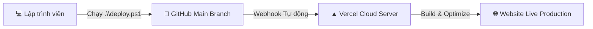

# 📖 HƯỚNG DẪN CÀI ĐẶT & CẤU HÌNH TOÀN DIỆN (END-TO-END SETUP GUIDE)
## ⚽ Football Prediction Tool — Nền tảng Mô phỏng & Dự đoán Bóng đá Đa Giải đấu

> **Chào mừng bạn đến với Football Prediction Tool!**  
> Đây là tài liệu hướng dẫn từng bước (Step-by-Step) dành cho cả **người mới bắt đầu (Newbies)** lẫn các **Senior Developers** để thiết lập, chạy thử nghiệm, thu thập dữ liệu tự động và triển khai dự án lên môi trường production một cách mượt mà nhất.

---

## 📑 Mục lục

1. [Giai đoạn 1: 🛠️ Chuẩn bị Môi trường Phát triển (Prerequisites)](#giai-đoạn-1-️-chuẩn-bị-môi-trường-phát-triển-prerequisites)
2. [Giai đoạn 2: 🤖 Cài đặt và Kết nối Google Antigravity](#giai-đoạn-2--cài-đặt-và-kết-nối-google-antigravity)
3. [Giai đoạn 3: 💻 Cài đặt Source Code Dự án (Project Initialization)](#giai-đoạn-3--cài-đặt-source-code-dự-án-project-initialization)
4. [Giai đoạn 4: 🕷️ Vận hành Hệ thống Lấy Dữ liệu (Web Scraper Engine)](#giai-đoạn-4-️-vận-hành-hệ-thống-lấy-dữ-liệu-web-scraper-engine)
5. [Giai đoạn 5: 🚀 Quy trình Triển khai Toàn diện (Deployment Workflow)](#giai-đoạn-5--quy-trình-triển-khai-toàn-diện-deployment-workflow)
6. [Phụ lục: ❓ Xử lý Sự cố Thường Gặp (Troubleshooting & FAQs)](#phụ-lục--xử-lý-sự-cố-thường-gặp-troubleshooting--faqs)

---

## Giai đoạn 1: 🛠️ Chuẩn bị Môi trường Phát triển (Prerequisites)

Trước khi bắt tay vào chạy code, máy tính của bạn cần được trang bị các công cụ tiêu chuẩn sau:

### 1.1. Cài đặt Node.js (Bản LTS)
* **Vai trò:** Môi trường thực thi JavaScript giúp bạn chạy dev server, build dự án và vận hành các script cào dữ liệu (crawlers).
* **Cách tải:** 
  - Truy cập trang chủ: [https://nodejs.org](https://nodejs.org)
  - Chọn tải phiên bản **LTS (Long Term Support)** (Khuyến nghị phiên bản **v18.x** hoặc **v20.x** trở lên).
  - Chạy file cài đặt (`.msi` trên Windows hoặc `.pkg` trên macOS) và làm theo hướng dẫn (Next -> Next -> Finish).

### 1.2. Cài đặt Git (Hệ thống Quản lý Phiên bản)
* **Vai trò:** Quản lý mã nguồn, clone repository và đồng bộ code lên GitHub.
* **Cách tải:**
  - Truy cập: [https://git-scm.com/downloads](https://git-scm.com/downloads)
  - Tải và cài đặt với các thiết lập mặc định.
* **Cấu hình định danh sau khi cài đặt (bắt buộc):**
  Mở terminal (PowerShell, Command Prompt hoặc Git Bash) và chạy 2 lệnh sau:
  ```bash
  git config --global user.name "Tên Của Bạn"
  git config --global user.email "email_cua_ban@example.com"
  ```

### 1.3. Cài đặt Visual Studio Code (VS Code)
* **Vai trò:** Trình biên soạn mã nguồn mạnh mẽ, hỗ trợ mở rộng tuyệt vời cho TypeScript và React.
* **Cách tải:** [https://code.visualstudio.com](https://code.visualstudio.com)
* **Extension khuyên dùng:**
  - `Tailwind CSS IntelliSense` (Gợi ý class Tailwind)
  - `Prettier - Code formatter` (Tự động format code)
  - `ESLint` (Kiểm tra quy chuẩn code)

### 1.4. Đăng ký Tài khoản GitHub & Vercel
* **GitHub:** Tạo tài khoản miễn phí tại [https://github.com](https://github.com) để lưu trữ repository.
* **Vercel:** Tạo tài khoản miễn phí tại [https://vercel.com](https://vercel.com) (Khuyến nghị chọn **"Continue with GitHub"** để kết nối trực tiếp với tài khoản GitHub của bạn, giúp việc deploy sau này hoàn toàn tự động).

### 1.5. Bảng kiểm tra phiên bản (Verification)
Sau khi cài đặt xong, hãy mở terminal và kiểm tra xem mọi thứ đã sẵn sàng chưa bằng các lệnh sau:

```bash
# Kiểm tra phiên bản Node.js (Nên là >= v18.0.0)
node -v

# Kiểm tra trình quản lý gói npm
npm -v

# Kiểm tra Git
git --version
```

> [!TIP]
> Nếu terminal báo lỗi `'node'` hoặc `'git'` không được nhận diện là lệnh nội bộ/bên ngoài, hãy khởi động lại máy tính hoặc VS Code để hệ thống cập nhật lại biến môi trường (Environment PATH).

---

## Giai đoạn 2: 🤖 Cài đặt và Kết nối Google Antigravity

### 2.1. Vai trò của Google Antigravity trong Dự án
**Google Antigravity** là trợ lý lập trình AI thế hệ mới (Agentic AI Coding Assistant). Trong dự án `football_prediction_tool`, Antigravity đóng vai trò là một **Senior Pair-Programmer**:
- Tự động phân tích cấu trúc giải đấu (Cup, League, Knockout Bracket).
- Viết và tối ưu hóa các module mô phỏng thuật toán tỉ số, bảng xếp hạng.
- Hỗ trợ xây dựng scraper cào tỷ số thời gian thực và tự động tạo giao diện người dùng.
- Thực hiện kiểm thử, refactor code, và tự động hóa quy trình deploy.

### 2.2. Cài đặt Antigravity App / CLI & Đăng nhập
1. **Tải và cài đặt:** Tải ứng dụng hoặc bộ công cụ CLI của Google Antigravity theo hướng dẫn phân phối nội bộ/tổ chức của bạn.
2. **Đăng nhập (Authentication):**
   - Mở giao diện Antigravity hoặc chạy lệnh:
     ```bash
     agy login
     ```
   - Chọn đăng nhập bằng tài khoản Google đã được cấp quyền truy cập.

### 2.3. Kết nối (Map) Thư mục Dự án vào Workspace Antigravity
Để AI có thể trực tiếp đọc cấu trúc file, sửa mã nguồn và chạy các công cụ trong dự án, bạn cần liên kết thư mục `football_prediction_tool` vào không gian làm việc (Workspace):

1. Mở **Antigravity IDE / Desktop App**.
2. Chọn menu **File** -> **Open Folder...** (hoặc **Add Folder to Workspace**).
3. Điều hướng và chọn đúng thư mục chứa dự án:
   ```text
   e:\Study\vibe-antigravity\football_prediction_tool
   ```
4. Xác nhận cấp quyền truy cập **Read & Write (Đọc & Ghi)** cho Workspace.

> [!NOTE]
> Khi thư mục được Map thành công, Antigravity sẽ tự động quét các file cấu hình (`package.json`, `tsconfig.json`, `tailwind.config.js`) và kích hoạt các Subagent chuyên trách (Research Subagent, Planning Subagent) để hỗ trợ bạn lập trình nhanh hơn gấp nhiều lần.

---

## Giai đoạn 3: 💻 Cài đặt Source Code Dự án (Project Initialization)

Hãy làm theo các bước dưới đây để đưa mã nguồn về máy và khởi chạy môi trường giả lập cục bộ.

### 3.1. Clone Repository về máy
Mở terminal và di chuyển đến thư mục bạn muốn lưu dự án:

```bash
# 1. Clone mã nguồn từ GitHub
git clone https://github.com/lqbandev/football_prediction_tool.git

# 2. Di chuyển vào thư mục dự án
cd football_prediction_tool
```

### 3.2. Cài đặt các gói thư viện phụ thuộc (Dependencies)
Cài đặt toàn bộ thư viện cần thiết đã được định nghĩa trong `package.json`:

```bash
npm install
```

### 3.3. Giải thích ngắn gọn về các Thư viện Lõi (Core Stack)

| Thư viện / Package | Vai trò & Mục đích sử dụng trong dự án |
| :--- | :--- |
| **React 18** (`react`, `react-dom`) | Thư viện nền tảng xây dựng giao diện người dùng theo mô hình component hướng trạng thái (State-driven UI). |
| **TypeScript** | Ngôn ngữ tĩnh giúp định nghĩa chặt chẽ kiểu dữ liệu cho Đội bóng (`Team`), Cầu thủ (`Player`), Trận đấu (`Match`), Bracket... giảm thiểu lỗi runtime. |
| **Vite** | Công cụ build và máy chủ phát triển cực nhanh với tính năng HMR (Hot Module Replacement) cập nhật giao diện tức thì khi sửa code. |
| **Tailwind CSS** | Framework CSS utility-first giúp thiết kế giao diện bóng đá hiện đại, responsive mượt mà trên cả Mobile, Tablet và Desktop. |
| **Lucide React** (`lucide-react`) | Bộ sưu tập icon vector phong phú: cúp vô địch, bóng đá, bảng xếp hạng, mũi tên điều hướng, nút chia sẻ... |
| **flag-icons** | Bộ icon quốc kỳ chuẩn SVG cho 48 quốc gia tham gia FIFA World Cup 2026. |
| **react-confetti** | Hiệu ứng pháo hoa rực rỡ khi người dùng mô phỏng ra nhà vô địch giải đấu. |
| **react-router-dom** | Quản lý điều hướng mượt mà giữa Landing Page, Competition Hub, World Cup 2026 Simulator và các giải đấu mở rộng khác. |
| **Axios / Native Fetch** | Xử lý các yêu cầu HTTP kết nối API lấy dữ liệu bóng đá trực tuyến. |

### 3.4. Khởi động Máy chủ Ảo (Development Server)
Khởi chạy dự án ở môi trường local:

```bash
npm run dev
```

Sau khi chạy lệnh, terminal sẽ hiển thị thông tin tương tự:
```text
  VITE v5.2.8  ready in 240 ms

  ➜  Local:   http://localhost:5173/
  ➜  Network: use --host to expose
```

👉 Hãy mở trình duyệt và truy cập vào đường dẫn: **`http://localhost:5173/`** để trải nghiệm ứng dụng.

### 3.5. Kiểm tra Build Production (Tùy chọn)
Để đảm bảo toàn bộ mã nguồn không có lỗi TypeScript hay cú pháp trước khi deploy:

```bash
# Biên dịch và đóng gói code
npm run build

# Xem thử bản đóng gói production ngay tại local
npm run preview
```

---

## Giai đoạn 4: 🕷️ Vận hành Hệ thống Lấy Dữ liệu (Web Scraper Engine)

Dự án tích hợp sẵn công cụ cào dữ liệu tự động để cập nhật kết quả thực tế của **FIFA World Cup 2026** từ TheSportsDB API kết hợp bộ dữ liệu chuẩn hóa độc quyền.

### 4.1. File kịch bản `scripts/crawl_wc26_results.js`
File script này thực hiện các tác vụ tự động:
1. Đọc danh sách 48 đội tuyển từ `src/data/tournament.ts`.
2. Đọc danh sách cầu thủ từng đội từ `src/data/players.ts`.
3. Tự động sinh danh sách 72 trận đấu vòng bảng (Bảng A đến L).
4. Gửi HTTP Request đến TheSportsDB API để lấy dữ liệu tỷ số, người ghi bàn, thời gian ghi bàn và Cầu thủ xuất sắc nhất trận (MOTM).
5. Áp dụng bảng ánh xạ chuẩn `REAL_RESULTS_OVERRIDES` để đảm bảo 100% tính chính xác của dữ liệu giải đấu.
6. Ghi toàn bộ kết quả vào file cơ sở dữ liệu tĩnh `src/data/real_results.json`.

### 4.2. Hướng dẫn chạy Crawler
Để cập nhật dữ liệu mới nhất, hãy mở terminal tại thư mục gốc dự án và chạy:

```bash
node scripts/crawl_wc26_results.js
```

**Kết quả màn hình console hiển thị:**
```text
========================================
   FIFA World Cup 2026 Results Scraper  
========================================
Loaded 48 teams and rosters from source files.
Fetching World Cup 2026 events from TheSportsDB API...
Processing match group-A-1: MEXICO vs SOUTH AFRICA (Score: 2-0)
...
========================================
Success! Updated 72 matches in real_results.json.
Database saved to: src/data/real_results.json
========================================
```

### 4.3. Cơ chế Hoạt động của `src/data/real_results.json`
File `real_results.json` đóng vai trò là kho dữ liệu trung tâm (Data Store) cho chế độ **"Kết quả thực tế / Real Results"**:

```json
{
  "lastUpdated": "2026-06-23T00:00:00.000Z",
  "source": "TheSportsDB / Live",
  "matches": {
    "group-A-1": {
      "homeScore": 2,
      "awayScore": 0,
      "scorers": [
        { "playerName": "JULIÁN QUIÑONES", "minute": 9, "side": "home", "teamId": "mexico" },
        { "playerName": "RAÚL JIMÉNEZ", "minute": 67, "side": "home", "teamId": "mexico" }
      ],
      "motm": { "playerName": "JULIÁN QUIÑONES", "teamName": "Mexico" }
    }
  }
}
```

* **`lastUpdated`:** Lưu thời điểm cập nhật mới nhất.
* **`matches`:** Object chứa mã trận đấu (`group-A-1`, `group-A-2`...).
* **`homeScore` & `awayScore`:** Tỷ số thực tế của trận đấu.
* **`scorers`:** Danh sách cầu thủ ghi bàn kèm số phút chính xác trên sân.
* **`motm`:** Cầu thủ xuất sắc nhất trận (Man of the Match).

> [!IMPORTANT]
> Trong giao diện người dùng, khi người dùng kích hoạt chế độ **"Áp dụng kết quả thực tế"**, Hook `useTournament` sẽ trực tiếp đọc dữ liệu từ `real_results.json`, khóa cứng các tỷ số đã diễn ra và tính toán lại bảng xếp hạng ngay tức thì!

---

## Giai đoạn 5: 🚀 Quy trình Triển khai Toàn diện (Deployment Workflow)

Dự án sử dụng cơ chế **Continuous Deployment (CD)** hiện đại thông qua sự kết hợp giữa **GitHub** và **Vercel**.



### 5.1. Kết nối GitHub Repository với Vercel (Thực hiện lần đầu)
1. Đăng nhập vào [Vercel Dashboard](https://vercel.com/dashboard).
2. Nhấn nút **"Add New..."** -> Chọn **"Project"**.
3. Tại mục **Import Git Repository**, tìm và chọn repository `football_prediction_tool`.
4. Kiểm tra cấu hình dự án:
   - **Framework Preset:** `Vite`
   - **Root Directory:** `./`
   - **Build Command:** `npm run build`
   - **Output Directory:** `dist`
   - **Install Command:** `npm install`
5. Nhấn nút **"Deploy"**. Vercel sẽ tự động build và cấp cho bạn một domain trực tiếp (ví dụ: `https://football-prediction-tool.vercel.app`).

---

### 5.2. Tự động hóa Triển khai với Script `deploy.ps1`
Dự án đã tích hợp sẵn script PowerShell `deploy.ps1` tại thư mục gốc giúp bạn tự động hóa toàn bộ quy trình đẩy code:

#### Các bước script tự động thực thi:
1. **Step 1/5:** Tự động tạo hoặc chuyển sang nhánh feature.
2. **Step 2/5:** Gom và commit toàn bộ thay đổi (`git add .` và `git commit`).
3. **Step 3/5:** Chuyển về nhánh `main` và kéo code mới nhất (`git pull origin main`).
4. **Step 4/5:** Merge nhánh feature vào nhánh `main`.
5. **Step 5/5:** Đẩy code lên GitHub (`git push origin main`) và dọn dẹp nhánh feature tạm thời.

#### Hướng dẫn chạy script:
Mở PowerShell tại thư mục dự án và chạy một trong các lệnh sau:

```bash
# Cách 1: Chạy nhanh với cấu hình mặc định
.\deploy.ps1

# Cách 2: Tùy biến tên nhánh và thông điệp commit
.\deploy.ps1 -BranchName "feature/update-scores" -CommitMessage "feat: cap nhat ty so vong bang WC2026"
```

---

### 5.3. Cơ chế Continuous Deployment (CD)
> [!IMPORTANT]
> Nhờ vào cơ chế **Continuous Deployment (CD)** của Vercel:
> - Mỗi khi script `deploy.ps1` thực hiện lệnh `git push origin main` thành công, Vercel sẽ nhận tín hiệu webhook ngay lập tức.
> - Vercel sẽ tự động khởi tạo môi trường máy chủ ảo, chạy `npm run build` và cập nhật phiên bản web mới nhất ra toàn thế giới trong vòng **dưới 60 giây**.
> - Bạn **không cần** phải SSH vào server hay thao tác thủ công trên hosting!

---

## Phụ lục: ❓ Xử lý Sự cố Thường Gặp (Troubleshooting & FAQs)

### 1. Lỗi PowerShell không cho phép chạy script `deploy.ps1`
* **Hiện tượng:** Báo lỗi `File deploy.ps1 cannot be loaded because running scripts is disabled on this system`.
* **Khắc phục:** Mở PowerShell với quyền Administrator và chạy lệnh:
  ```bash
  Set-ExecutionPolicy RemoteSigned -Scope CurrentUser
  ```

### 2. Cổng (Port) 5173 đã bị chiếm dụng
* **Hiện tượng:** Vite tự chuyển sang port `5174` hoặc báo lỗi EADDRINUSE.
* **Khắc phục:** Bạn có thể tiếp tục sử dụng port mới hoặc tắt tiến trình đang chiếm cổng bằng lệnh:
  ```bash
  # Tìm và dừng tiến trình trên port 5173
  npx kill-port 5173
  ```

### 3. Lỗi không tìm thấy hàm `fetch` khi chạy Web Scraper
* **Hiện tượng:** Báo lỗi `fetch is not defined` khi chạy `node scripts/crawl_wc26_results.js`.
* **Khắc phục:** Native `fetch` có sẵn từ phiên bản **Node.js v18 trở lên**. Hãy cập nhật phiên bản Node.js lên bản LTS mới nhất.

---

<div align="center">

🏆 **Chúc bạn có những trải nghiệm dự đoán và mô phỏng bóng đá tuyệt vời cùng Football Prediction Tool!**  
*Mọi đóng góp và thắc mắc xin vui lòng mở Issue hoặc Pull Request trên GitHub repository.*

</div>
